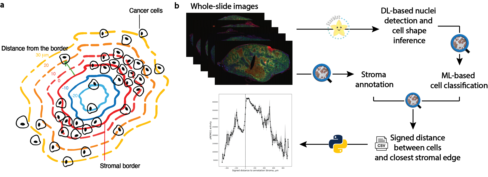

# An Image Analysis Pipeline for Quantifying the Spatial Distribution of Fluorescently-Labeled Cell Markers in Stroma-Rich Tumors



## Overview
This code repository provides the implementtion of an image analysis pipeline for quantifying the spatial distributipm of fluorescently-labeled cell markers in relation to the stromal border of solid tumor environments. The pipeline is designed to process high-resolution whole-slide images of fluorescently-labeled tissue sections and consists of: (1) a deep learning-based nuclei segmentation step using StarDist, (2) a machine learning-based composite classification step and (3) a parameter sensitivity analysis and visualization step. The pipeline is implemented in QuPath (Groovy) and Python.


## Features
- Segmentation of nuclei in fluorescent images using pre-trained DL models
- Machine-learning based composite classification of cancer cells of interest
- Quantitative analysis of fluorescent markers across many images
- Spatial distribution using cell-stroma 2D signed distance
- Compatible with high-resolution whole-slide images 
- Visualization, sensitivity and statistical analysis of results in Python


## Software requirements
- Python 3.7 or higher (install required packages with `pip install -r requirements.txt`)
- QuPath 0.5 or higher
- StarDist extension for QuPath
- The pipeline was developed and tested on MacOS Ventura 10.5. 


## Install dependencies
To install the required Python packages, run the following commands in your terminal:

```bash
conda create -n stroma-spatial-analysis python=3.7
conda activate stroma-spatial-analysis
pip install -r requirements.txt
```

It should not take more than a few minutes to install all the required packages.


## Datasets
[](https://doi.org/10.5281/zenodo.13122087)

Resulting cell measurements tables, are free to download at https://doi.org/10.5281/zenodo.13122087. Download the tables and run the Jupyter notebooks to reproduce the results.


## Distribution
Our image analysis pipeline is distributed as a collection of Groovy scripts for image processing in QuPath and Python Jupyter notebooks for statistical analysis and visualization.

This repository is distributed under the MIT license. You are free to use, modify, and distribute the code as long as you provide proper attribution to the authors.